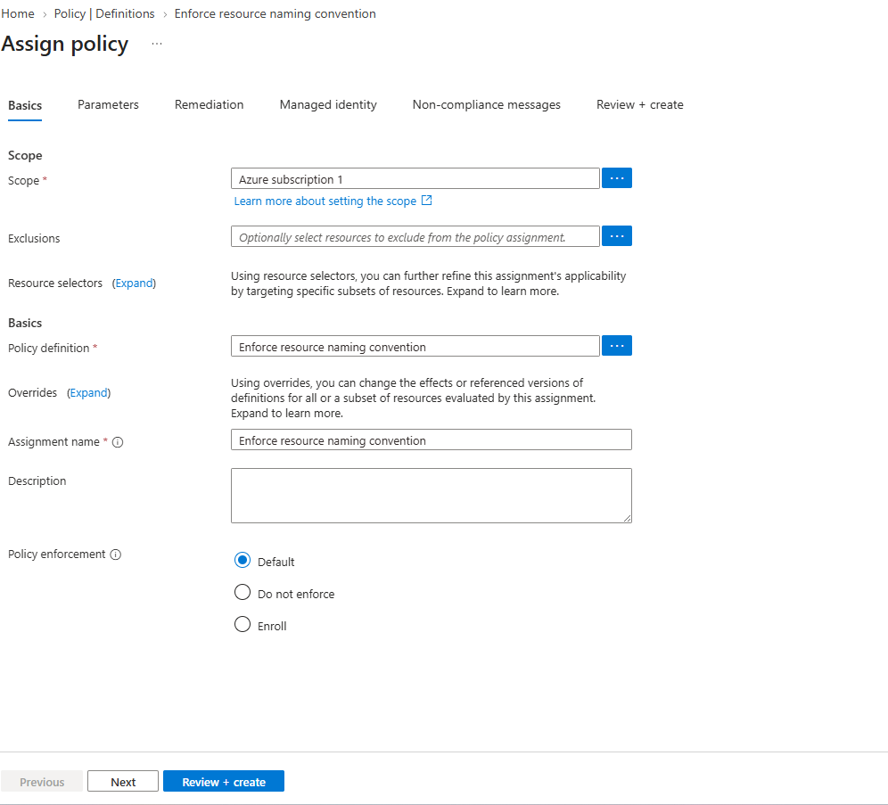
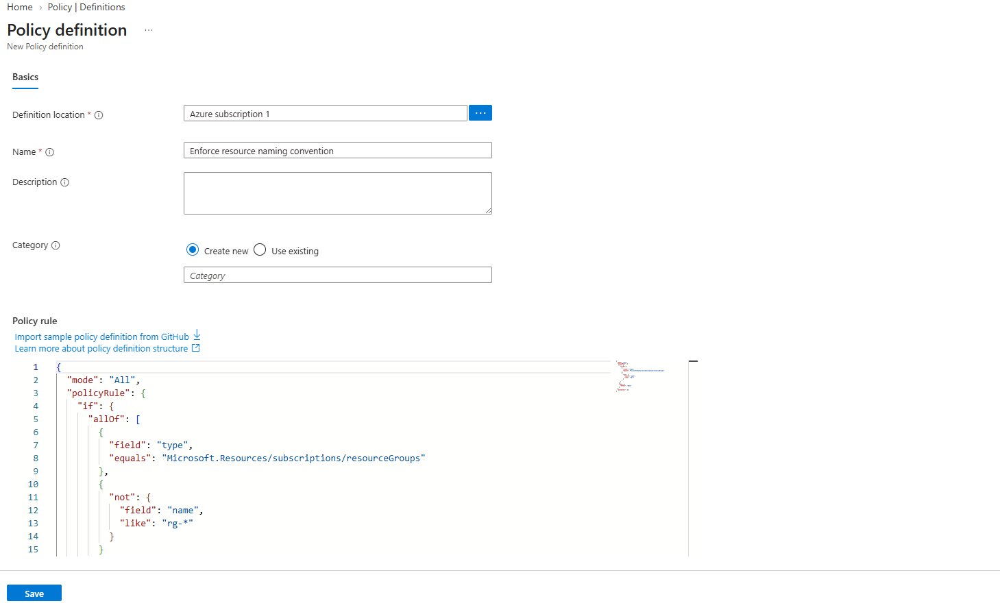

# Azure Policy

Azure Policy is Azure's governance layer for enforcing standards across subscriptions, resource groups, and individual resources. It is one of the most common interview topics because it sits at the point where cloud architecture meets security, compliance, and platform operations.

## What Azure Policy Does

Azure Policy helps you:

- restrict what can be deployed
- require specific tags
- limit allowed Azure regions
- enforce security settings
- audit resources that drift from standards
- remediate some non-compliant resources automatically

The simple way to describe it in an interview is:

`Azure Policy evaluates resources against rules and either audits, denies, or fixes them depending on how the policy is assigned.`

## Core Concepts

### Definition

A policy definition is the rule itself. It describes what Azure should check and what effect it should apply.

Examples:

- only allow certain regions
- require the `Environment` tag
- require secure transfer on storage accounts

### Initiative

An initiative is a group of related policies bundled together under one assignment.

Examples:

- security baseline initiative
- cost governance initiative
- production tagging initiative

### Assignment

An assignment applies a policy or initiative to a scope.

Common scopes:

- management group
- subscription
- resource group

### Parameters

Parameters let the same policy be reused with different values.

Example:

- one region restriction policy can accept `eastus`, `centralus`, or `westus2` as allowed values

### Exemption

An exemption documents an approved exception for a resource or scope without removing the broader policy assignment.

## Common Policy Effects

- `Deny`: blocks non-compliant deployments
- `Audit`: allows the deployment but marks it non-compliant
- `Append`: adds fields to the request
- `Modify`: updates properties during deployment when supported
- `DeployIfNotExists`: deploys supporting configuration if missing
- `AuditIfNotExists`: checks whether a dependent configuration exists
- `Disabled`: turns off evaluation for that assignment

For interviews, the most important three are usually:

- `Deny`
- `Audit`
- `DeployIfNotExists`

## Step By Step in the Azure Portal

This is the easiest interview-ready flow to remember.

### 1. Open Azure Policy

In the Azure Portal:

1. Search for `Policy`
2. Open the `Policy` service

### 2. Choose Definitions

Inside Azure Policy:

1. Open `Definitions`
2. Search for the built-in policy you want

Good starter examples:

- `Allowed locations`
- `Require a tag and its value`
- `Storage accounts should restrict network access`
- `Kubernetes clusters should use Azure Policy add-on`

### 3. Start an Assignment

1. Open the policy definition
2. Click `Assign`

### 4. Pick the Scope

Choose where the policy will apply:

- management group for enterprise-wide governance
- subscription for environment-wide control
- resource group for a specific app or project

For practice, resource group scope is the safest place to start.

### 5. Set Exclusions If Needed

If one resource group or resource should be excluded, add it under exclusions instead of skipping the policy entirely.

### 6. Fill Parameters

If the definition requires parameters, provide them now.

Examples:

- allowed regions
- tag name
- tag value
- SKU restrictions

### 7. Choose the Effect

Many built-in policies let you choose the effect.

Good progression for real-world rollout:

1. start with `Audit`
2. review compliance results
3. move to `Deny` once you are confident it will not break valid deployments

### 8. Enable Remediation If Supported

If the policy uses `Modify` or `DeployIfNotExists`, Azure can create remediation tasks to fix existing resources.

This is especially useful for:

- missing tags
- diagnostic settings
- security configuration baselines

### 9. Create the Assignment

Click `Review + create`, then `Create`.

### 10. Review Compliance

After assignment:

1. go back to `Policy`
2. open `Compliance`
3. review compliant and non-compliant resources

This is where you see whether the assignment is working and what still needs remediation.

## Step By Step: Naming Convention Policy

For naming conventions, the most practical approach is usually a custom Azure Policy. Built-in policies are great for many governance controls, but naming standards often need your own rule so you can match your team's prefixes.

A common example is enforcing resource group names to start with `rg-`.

### 1. Open Azure Policy and Start an Assignment

From the Azure Portal:

1. Search for `Policy`
2. Open the `Policy` service
3. Go to `Compliance` or `Assignments`
4. Click `Assign policy`

This screenshot shows the assignment screen in the portal, including the scope, definition picker, assignment name, and enforcement settings.



### 2. Choose or Create the Policy Definition

For a naming convention, you normally create a custom definition first and then assign it.

In the `Assign policy` screen:

1. Click the `...` button next to `Policy definition`
2. Review available definitions
3. If you do not already have a custom naming policy, go to `Definitions` and create one

This screenshot is useful because it shows the built-in policy browser that appears when selecting a definition.



### 3. Create a Custom Policy Definition for Resource Group Names

In `Policy > Definitions`:

1. Click `+ Policy definition`
2. Choose your subscription as the definition location
3. Set a name such as `Enforce resource group naming`
4. Use a category such as `Governance`
5. Paste a custom JSON rule

Use this rule to require resource groups to begin with `rg-`:

```json
{
  "mode": "All",
  "policyRule": {
    "if": {
      "allOf": [
        {
          "field": "type",
          "equals": "Microsoft.Resources/subscriptions/resourceGroups"
        },
        {
          "not": {
            "field": "name",
            "like": "rg-*"
          }
        }
      ]
    },
    "then": {
      "effect": "deny"
    }
  },
  "parameters": {}
}
```

This policy means:

- if the resource being created is a resource group
- and its name does not match `rg-*`
- deny the deployment

### 4. Save the Definition

After saving the custom definition, return to `Assign policy` and select it from the policy definition picker.

### 5. Fill in the Assignment Basics

On the `Basics` tab:

- `Scope`: choose the subscription or management group where the rule should apply
- `Exclusions`: leave blank unless there is a known exception
- `Policy definition`: choose your custom naming policy
- `Assignment name`: use something clear like `deny-nonstandard-resource-group-names`
- `Description`: describe the naming rule briefly
- `Policy enforcement`: keep `Default` to enforce it

For a safer rollout, you can start with an `Audit` effect in the definition instead of `Deny`, review the results, and then switch to `Deny`.

### 6. Review Parameters, Remediation, and Create

If the policy has no parameters, the remaining tabs are usually minimal for this case. Continue through:

- `Parameters`
- `Remediation`
- `Managed identity`
- `Non-compliance messages`
- `Review + create`

Then click `Create`.

### 7. Test the Policy

Try creating two resource groups:

- `test-group`
- `rg-test-group`

Expected result:

- `test-group` should be denied
- `rg-test-group` should be allowed

### 8. Review Compliance

Go back to `Policy > Compliance` and review the assignment results. This is where Azure shows whether resources match the naming rule and where non-compliant attempts appear.

## Variations You Can Build

Instead of one huge naming policy for every Azure service, it is often cleaner to create separate policies for important resource types.

Examples:

- resource groups: `rg-*`
- virtual networks: `vnet-*`
- subnets: `snet-*`
- AKS clusters: `aks-*`
- storage accounts: `st*`
- container registries: `acr*`

This makes each policy easier to explain, test, and maintain.

## Step By Step with Azure CLI

### Example 1: Require a Tag

List policy definitions and find the one you want:

```bash
az policy definition list --query "[?contains(displayName, 'Require a tag')].{Name:displayName, Id:id}" -o table
```

Assign the policy at resource group scope:

```bash
az policy assignment create \
  --name require-environment-tag \
  --display-name "Require Environment tag" \
  --scope "/subscriptions/<subscription-id>/resourceGroups/<resource-group-name>" \
  --policy "<policy-definition-id>" \
  --params "{ \"tagName\": { \"value\": \"Environment\" } }"
```

### Example 2: Restrict Allowed Regions

```bash
az policy assignment create \
  --name allowed-locations \
  --display-name "Allow only approved Azure regions" \
  --scope "/subscriptions/<subscription-id>" \
  --policy "<policy-definition-id>" \
  --params "{ \"listOfAllowedLocations\": { \"value\": [\"eastus\", \"centralus\"] } }"
```

### Example 3: Check Compliance State

```bash
az policy state list \
  --query "[].{Resource:resourceId, Compliance:complianceState, Policy:policyDefinitionName}" \
  -o table
```

## Step By Step with Bicep

You can also assign Azure Policy through infrastructure as code.

Example: assign a built-in policy at resource group scope.

```bicep
targetScope = 'resourceGroup'

@description('Built-in policy definition ID')
param policyDefinitionId string

resource policyAssignment 'Microsoft.Authorization/policyAssignments@2024-04-01' = {
  name: 'require-environment-tag'
  properties: {
    displayName: 'Require Environment tag'
    policyDefinitionId: policyDefinitionId
    parameters: {
      tagName: {
        value: 'Environment'
      }
    }
  }
}
```

This is a strong interview point because it shows that governance itself can be managed as code.

## Good Starter Policies To Know

### Governance Basics

- `Allowed locations`
- `Require a tag and its value`
- `Require a tag on resources`
- `Inherit a tag from the resource group if missing`

### Security Basics

- storage accounts should require secure transfer
- storage accounts should restrict public network access
- SQL should use auditing and threat protection where appropriate
- Key Vault should have purge protection enabled

### AKS Policies Worth Knowing

- Kubernetes clusters should use Azure Policy add-on
- Kubernetes clusters should disable local accounts in tighter environments
- containers should not run as privileged where policy models support it

## Practical Interview Examples

### Example 1: Limit Deployments to Approved Regions

Use `Allowed locations` at subscription scope so teams can only deploy to approved regions such as `East US` and `Central US`.

Why it matters:

- cost control
- data residency
- architectural consistency

### Example 2: Enforce Tags

Require tags like:

- `Environment`
- `Owner`
- `CostCenter`

Why it matters:

- cost reporting
- ownership
- automation and lifecycle management

### Example 3: Audit Storage Security

Use `Audit` first to find storage accounts that still allow insecure access or public network exposure.

Why it matters:

- safer rollout
- visibility before breaking deployments with `Deny`

### Example 4: Govern AKS

Use Azure Policy with AKS to enforce Kubernetes guardrails such as approved configurations or cluster security requirements.

Why it matters:

- centralized governance
- consistency across clusters
- less reliance on manual reviews

## Best Practices

- start with `Audit` before moving to `Deny`
- assign policies at the highest sensible scope
- use initiatives for grouped standards
- document exemptions clearly
- review compliance regularly
- use remediation tasks where supported
- manage important policy assignments as code

## Azure Policy vs RBAC

Interviewers often ask this.

- `RBAC` controls who can do something
- `Azure Policy` controls what is allowed or required

Example:

- RBAC decides whether a user can create a storage account
- Azure Policy decides whether that storage account must use secure transfer and approved regions

## What To Say In an Interview

Short version:

`I use Azure Policy to enforce governance standards like tags, approved regions, and security settings. I usually start with Audit to understand impact, then move to Deny for mature controls, and I prefer assigning repeatable policies through IaC when possible.`

Strong follow-up points:

- mention subscription or management group scope
- mention initiatives for grouped controls
- mention exemptions instead of removing policy
- mention remediation for drift
- mention the difference between RBAC and Policy

## Good Practice Scenario

If you want a simple hands-on exercise:

1. Create a test resource group
2. Assign `Require a tag on resources`
3. Set the tag name to `Environment`
4. Try deploying a resource without the tag
5. Review the compliance result
6. Reassign with `Audit` or `Deny` depending on the behavior you want to observe

That one exercise covers most of the policy discussion points people ask about in interviews.
