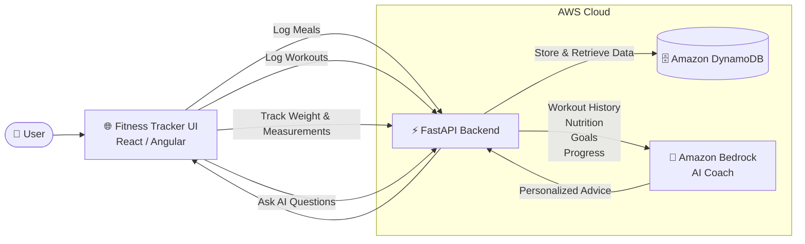

```mermaid
flowchart LR

    User([👤 User])

    UI[🌐 Fitness Tracker UI<br/>React / Angular]

    API[⚡ FastAPI Backend]

    DDB[(🗄️ Amazon DynamoDB)]

    Bedrock[🤖 Amazon Bedrock<br/>AI Coach]

    User --> UI

    UI -->|Log Meals| API
    UI -->|Log Workouts| API
    UI -->|Track Weight & Measurements| API
    UI -->|Ask AI Questions| API

    API -->|Store & Retrieve Data| DDB

    API -->|Workout History<br/>Nutrition<br/>Goals<br/>Progress| Bedrock

    Bedrock -->|Personalized Advice| API

    API --> UI

    subgraph AWS["AWS Cloud"]
        API
        DDB
        Bedrock
    end
```
