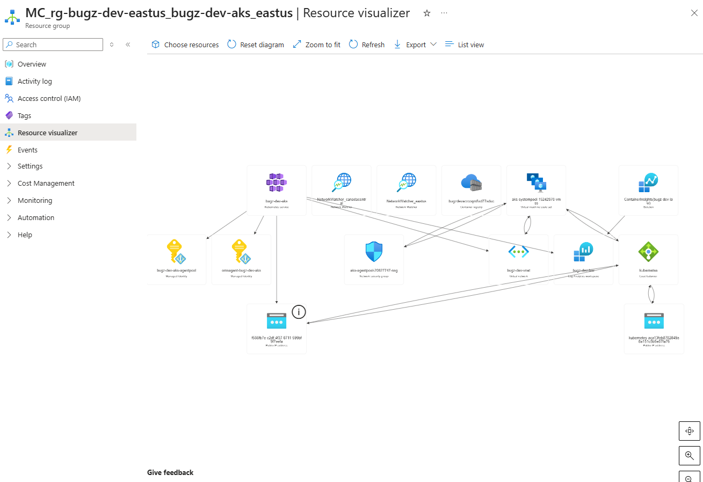
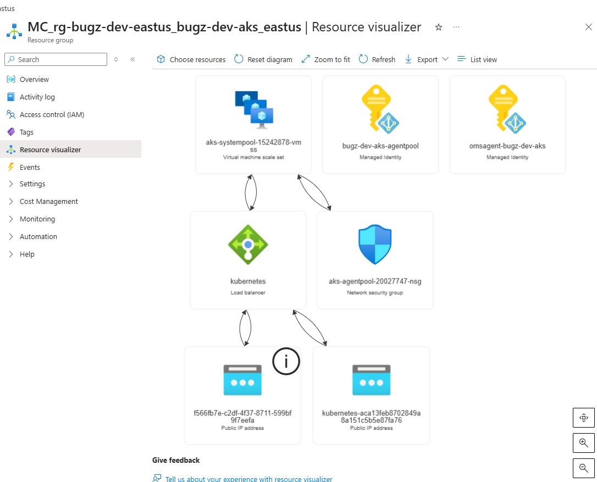

# Architecture

This project is a small AKS deployment, but the architecture is still a real Azure platform stack. The application itself is simple. The infrastructure around it is where most of the cloud story lives: compute, networking, identity, container registry, observability, and Azure-managed cluster resources.

## Azure Resource Model

Deploying this project creates two resource groups:

- `rg-bugz-dev-eastus`
- `MC_rg-bugz-dev-eastus_bugz-dev-aks_eastus`

The first resource group is the one defined by the Bicep deployment. The second is created automatically by AKS to hold the infrastructure Azure manages for the cluster.

## Primary Resource Group

`rg-bugz-dev-eastus` contains the resources intentionally deployed for the project:

- `bugz-dev-aks`
- `bugz-dev-vnet`
- `bugz-dev-law`
- `bugzdevacrcoqm5xd77sduc`
- `ContainerInsights (bugz-dev-law)`

This is the cleanest way to explain the project at a high level: the application platform, network, registry, and monitoring all start here.


## Managed Resource Group

`MC_rg-bugz-dev-eastus_bugz-dev-aks_eastus` is where Azure places the cluster infrastructure it owns and operates on your behalf.

That includes resources such as:

- the node pool virtual machine scale set
- the Azure load balancer
- public IP addresses
- the node pool network security group
- managed identities used by the cluster

This separation is useful because it makes it clear which resources are part of your IaC boundary and which ones are part of the AKS service boundary.


## Resource Visualizer

The Azure Resource Visualizer makes the relationships easier to explain than a flat resource list.

In the full managed resource group diagram, you can see the VM scale set, load balancer, public IPs, network security group, and managed identities as connected pieces of the same cluster platform.



The tighter visualizer view is especially useful for interviews because it isolates the core runtime pieces: node pool VMSS, load balancer, public IPs, NSG, and the identities Azure attached to the cluster.



## AKS

`bugz-dev-aks` is the Kubernetes control point for the project.

Its responsibilities include:

- scheduling workloads
- maintaining desired pod state
- routing service traffic inside the cluster
- exposing the application through a load balancer-backed Kubernetes service
- integrating with Azure networking and identity

The cluster is where the application deployment runs, but it is only one part of the overall Azure platform.

## Azure Container Registry

`bugzdevacrcoqm5xd77sduc` stores the `bugz-api` image used by the cluster.

The deployment flow is:

```text
Local build
   |
Docker image
   |
Push to ACR
   |
AKS pulls image
   |
Pods start in Kubernetes
```

This keeps the image supply path private and Azure-native.

## Networking

The project uses:

- `bugz-dev-vnet`
- `aks-subnet`
- an Azure-managed load balancer
- a node pool network security group
- public IP resources in the managed resource group

The public request flow looks like this:

```text
Browser
  |
Azure Public IP
  |
Azure Load Balancer
  |
Kubernetes Service
  |
Bugz Pods
```

The VNet and subnet provide the private address space for the cluster infrastructure, while the load balancer provides the public entry point.

## Virtual Machine Scale Set

AKS uses a virtual machine scale set to host the worker nodes.

That means Azure can:

- provision nodes automatically
- replace unhealthy nodes
- change capacity through node scaling
- attach the node infrastructure to the cluster load balancer and NSG

This is a useful distinction in interviews: Kubernetes schedules pods, but those pods still need actual compute underneath them.

## Managed Identity

Managed identity is one of the most important platform features in this project.

In this deployment, Azure created managed identities for the cluster components rather than requiring registry credentials to be stored in Kubernetes manifests or application configuration.

The visualizer screenshots show two identities clearly:

- `bugz-dev-aks-agentpool`
- `omsagent-bugz-dev-aks`

The key idea is:

- the AKS-related identity can be granted Azure RBAC permissions such as `AcrPull`
- that permission allows the cluster to pull images from ACR securely
- no registry username or password needs to be embedded in the app deployment

This is a strong talking point because it shows secure service-to-service authentication using Azure-native identity instead of secrets.

## Observability

Monitoring is built around:

- `bugz-dev-law`
- `ContainerInsights (bugz-dev-law)`

These resources collect logs and metrics from the cluster and make troubleshooting easier by centralizing Kubernetes and infrastructure telemetry.

## Putting It Together

This deployment is best understood as a connected Azure platform:

```text
                  Azure Resource Group
                           |
       ------------------------------------------------
       |                 |               |            |
      AKS               ACR            VNet      Log Analytics
       |                 |               |            |
       |                 |               |      Container Insights
       |
 Managed Resource Group
       |
  -------------------------------
  |        |         |          |
 VMSS     NSG   Load Balancer  Managed Identities
                     |
                 Public IP
                     |
                  Bugz App
```

The main lesson from this project is that even a small AKS deployment is never just "a Kubernetes cluster." It is an identity-aware, networked, monitored container platform made up of both user-managed and Azure-managed resources.
