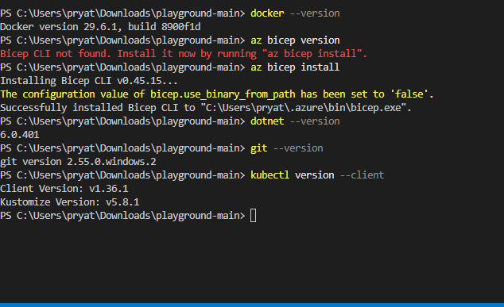
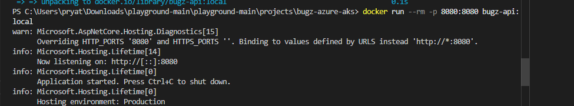
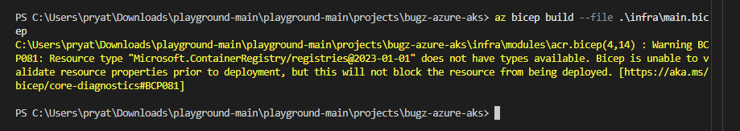

# Deployment

Example deployment from repository root:

pwsh ./playground-main/projects/bugz-azure-aks/scripts/deploy-infra.ps1 -projectName bugz -environment dev -location eastus -aksSku Standard_D2s_v7 -nodeCount 1 -resourceGroupName bugz-dev-rg

After infra deploy, build and push image:

pwsh ./playground-main/projects/bugz-azure-aks/scripts/build-and-push.ps1 -acrName <acrName> -imageTag v1

Then deploy to the cluster:

pwsh ./playground-main/projects/bugz-azure-aks/scripts/deploy-k8s.ps1 -resourceGroup bugz-dev-rg -aksName bugz-dev-aks -image <acrLoginServer>/bugz:v1

run az account show
az login 

az account show 

http://135.234.201.251/