Deploying Bugz to Azure Kubernetes Service
Overview

This guide walks through deploying the Bugz API from scratch using Azure.

By the end of this guide you will have:

An Azure subscription
Azure Cloud Shell configured
Azure CLI authenticated
Infrastructure deployed with Bicep
Docker image published to Azure Container Registry
ASP.NET Core application running in Azure Kubernetes Service
Phase 1: Create an Azure Subscription

If you do not already have an Azure subscription:

Navigate to the Azure Portal.
Select Start with an Azure free account (or create a Pay-As-You-Go subscription).
Complete account verification.
Wait for the subscription to become active.

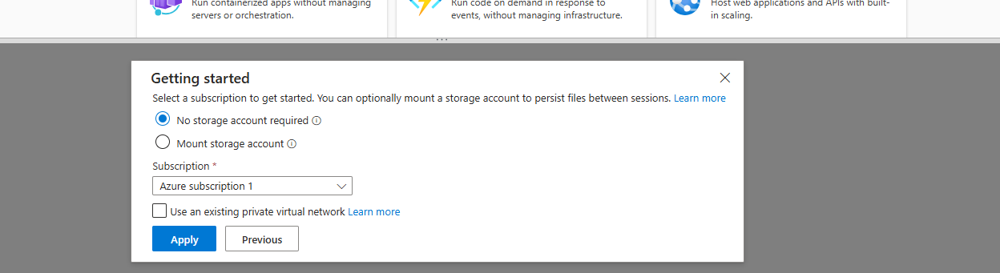

Phase 2: Open Azure Cloud Shell

From the Azure Portal:

Click the Cloud Shell icon.
Select Bash.

The first time Cloud Shell starts you'll be prompted to configure storage.

Choose:

No Storage Account Required
Your Azure Subscription

Click Apply.

Why?

Azure Cloud Shell provides a browser-based environment with the Azure CLI pre-installed, making it easy to deploy infrastructure without installing tools locally.

Phase 3: Authenticate with Azure CLI

If you're using a local terminal instead of Cloud Shell:

**az login**
A browser window opens for authentication.

Select your Azure subscription.

Phase 4: Verify the Active Subscription

Confirm you're connected to the correct Azure subscription.

**az account show**

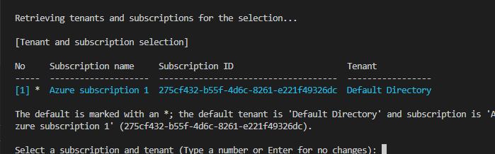

Verify:

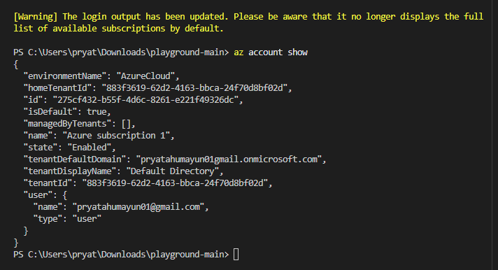

Subscription Name
Subscription ID
Tenant
Logged in account

This helps avoid deploying resources into the wrong subscription.

Phase 5: Clone the Repository
git clone https://github.com/<username>/playground-main.git

cd playground-main/projects/bugz-azure-aks
Phase 6: Validate the Infrastructure

Compile the Bicep templates.

**az bicep build --file .\infra\main.bicep**

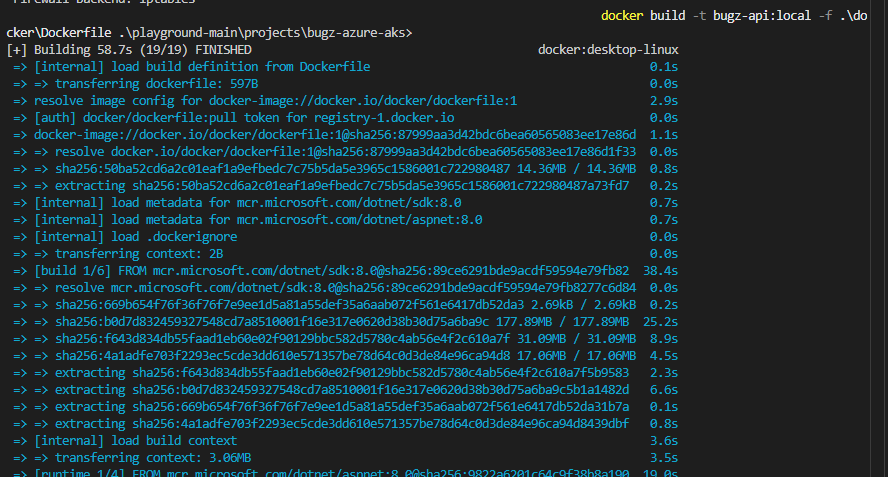

Phase 7: Preview Infrastructure Changes

Before deploying, review the proposed resource changes.

**az deployment group what-if ...**

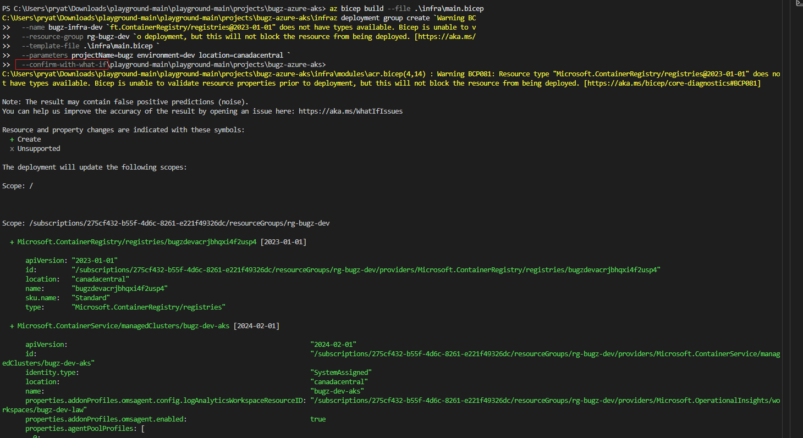

This command previews changes without modifying Azure resources.

Phase 8: Deploy Azure Infrastructure

Deploy the Bicep templates.

**az deployment group create ...**

Azure provisions:

Resource Group
Virtual Network
Azure Kubernetes Service
Azure Container Registry
Log Analytics Workspace
Managed Identity

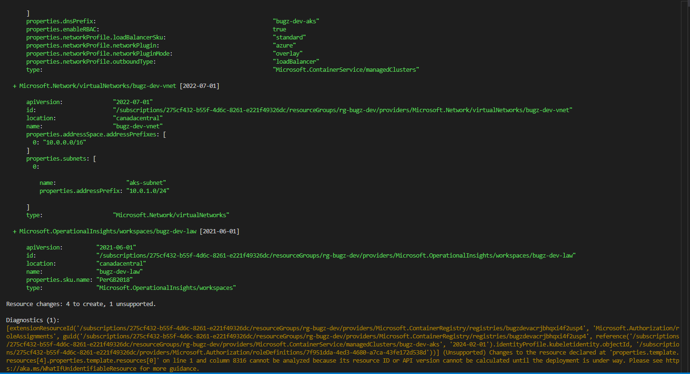

Phase 9: Connect to AKS
**az aks get-credentials \
  --resource-group rg-bugz-dev-eastus \
  --name bugz-dev-aks**

Verify:

kubectl get nodes

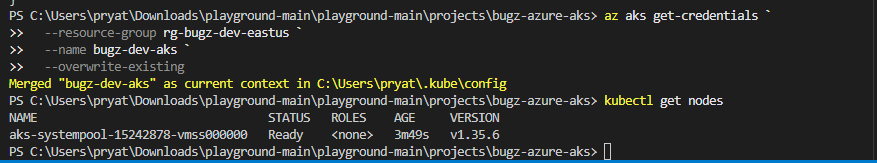

Phase 10: Build the Docker Image
**docker build -t bugz-api:local .**

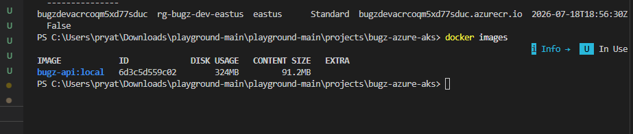

Phase 11: Test Locally
**docker run --rm -p 8080:8080 bugz-api:local**

Test:

Invoke-RestMethod http://localhost:8080/
Invoke-RestMethod http://localhost:8080/health

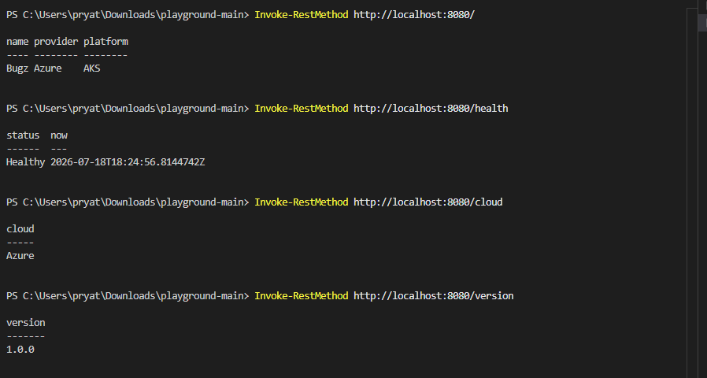

Phase 12: Push to Azure Container Registry
**docker tag ...
docker push ...**

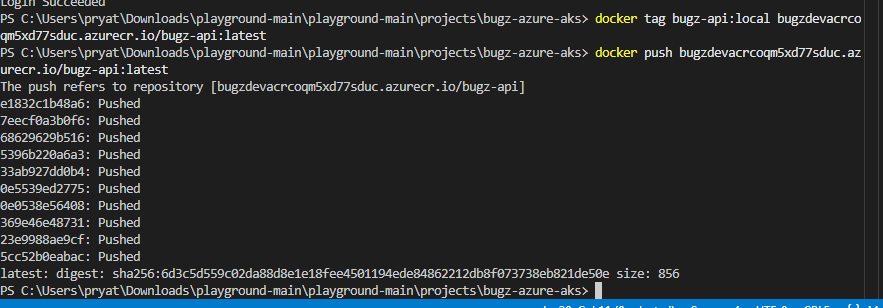

Phase 13: Deploy to Kubernetes
**kubectl apply -f k8s/**

Verify:

**kubectl get pods
kubectl get svc**
Phase 14: Verify the Application

Open:

http://135.234.201.251/

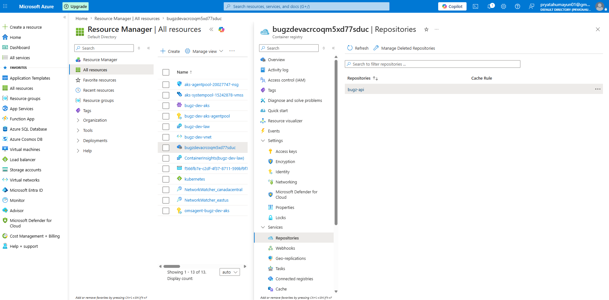
