# Azure Screenshots

This gallery walks through the deployed Bugz AKS environment using the Azure Portal screenshots captured from the live deployment. It follows the same path an interviewer or reviewer would take: start with the resource group, drill into AKS, trace the network path, inspect the managed infrastructure, and finish at the running application.

## 1. Primary Resource Group

The main resource group, `rg-bugz-dev-eastus`, contains the infrastructure created by the Bicep deployment in `East US`.

Core resources visible here:

- `bugz-dev-aks` for the Kubernetes cluster
- `bugz-dev-law` for Log Analytics
- `bugz-dev-vnet` for the virtual network
- the Azure Container Registry used to store the application image
- Container Insights for cluster monitoring

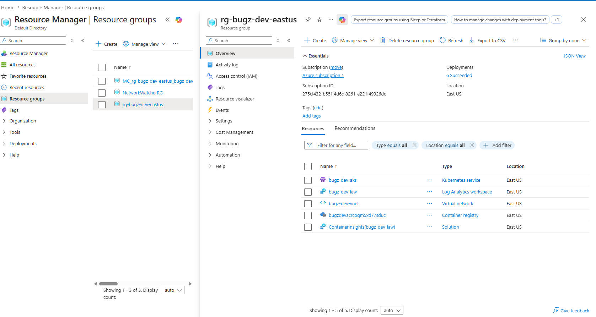

## 2. AKS Namespaces

Inside the AKS cluster, the portal shows both the platform namespaces and the application namespace.

The important detail here is that the custom `bugz` namespace is active alongside the standard namespaces such as `default`, `kube-system`, `kube-public`, and `kube-node-lease`.

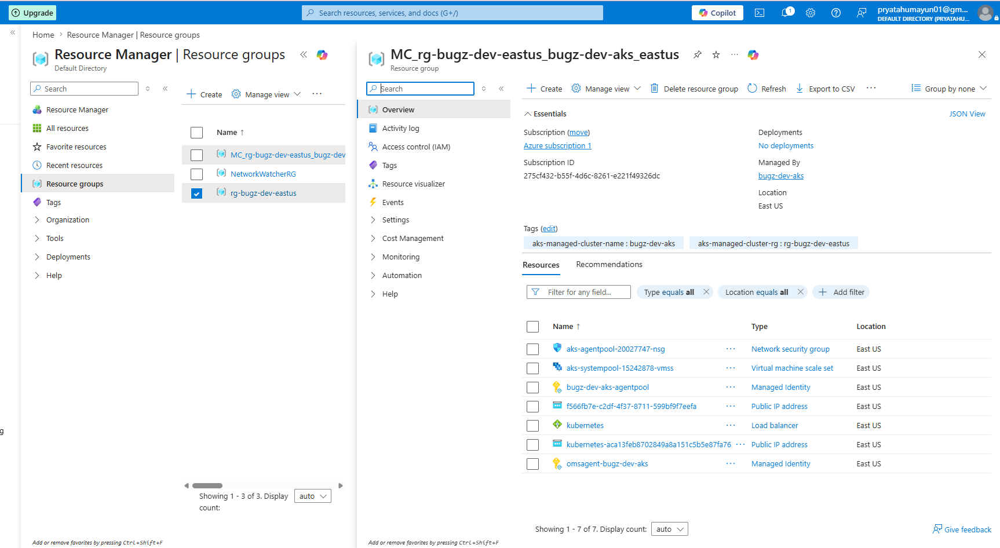

## 3. AKS Workloads

The workloads view confirms that the application deployment is actually running in the cluster, not just provisioned at the infrastructure layer.

Here, `bugz-api` is running in the `bugz` namespace with `2/2` replicas ready, while the system components remain healthy in `kube-system`.

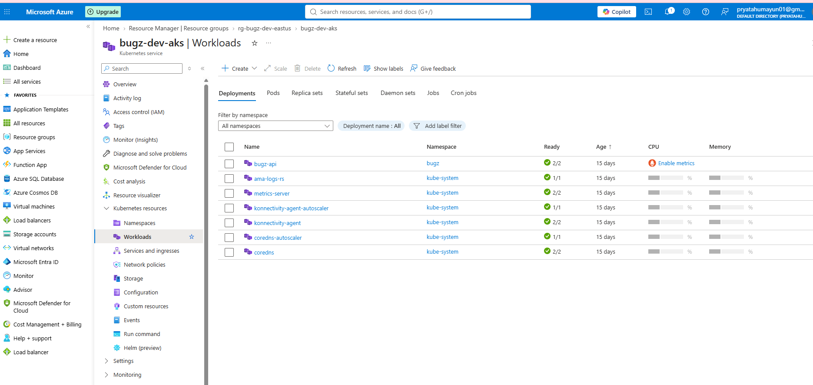

## 4. Services and Public Exposure

The services view shows how the application is exposed from Kubernetes.

The `bugz-api` service is of type `LoadBalancer`, which means Azure provisioned a public endpoint for the application. The screenshot also shows the cluster IP, the external IP, and the mapped service port.

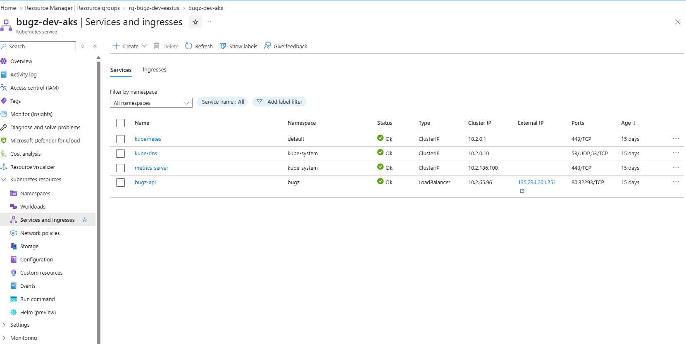

## 5. Virtual Network and Subnet

The project network is anchored by `bugz-dev-vnet`, with the AKS cluster using the `aks-subnet`.

This screenshot makes the subnetting easy to explain during a walkthrough:

- subnet name: `aks-subnet`
- address range: `10.0.1.0/24`
- available IPs remaining in the subnet

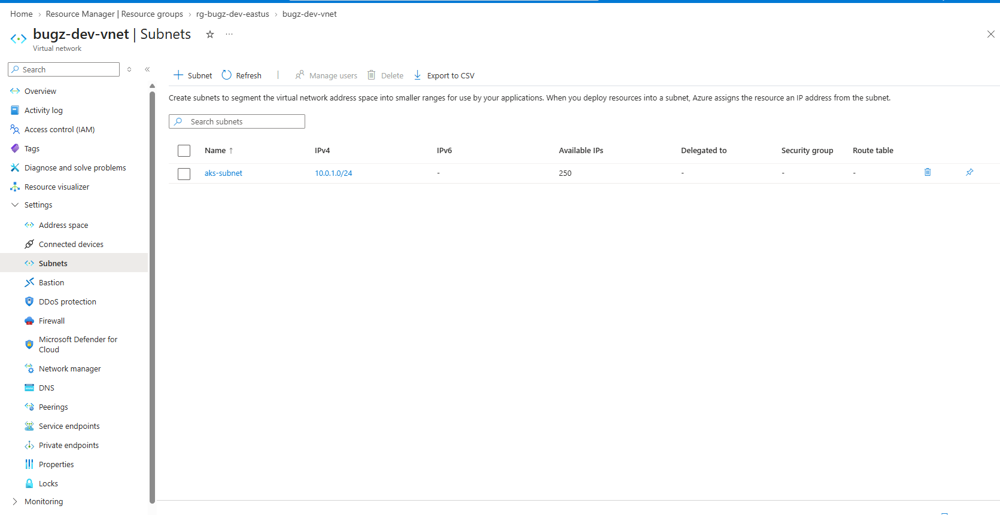

## 6. Azure Container Registry

The Azure Container Registry stores the container image used by the AKS deployment.

This repository view shows the private `bugz-api` repository that sits between the Docker build/push step and the AKS pull/deploy step.

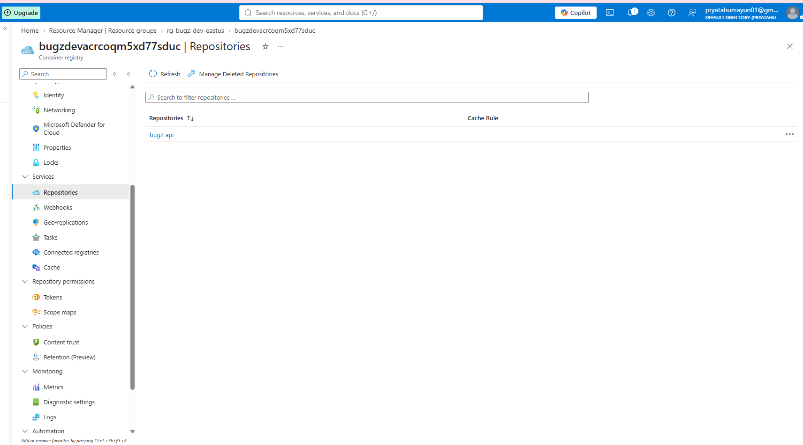

## 7. AKS Networking Profile

The AKS networking page gives a cluster-level view of the network design.

Important details visible here:

- network configuration: `Azure CNI Overlay`
- outbound type: `Load Balancer`
- pod CIDR: `10.244.0.0/16`
- service CIDR: `10.2.0.0/16`
- DNS service IP: `10.2.0.10`
- public API server access enabled
- standard Azure load balancer in use

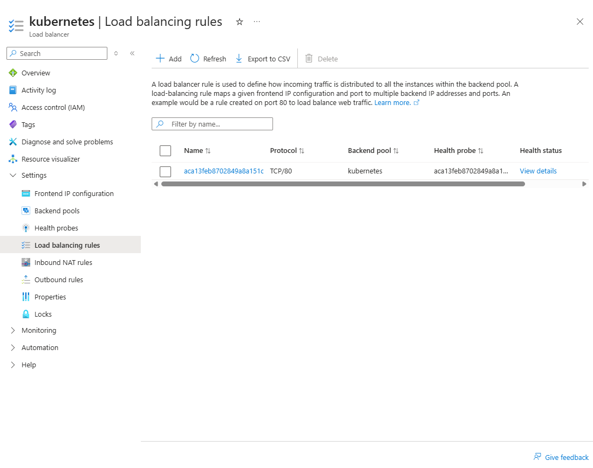

## 8. AKS Managed Resource Group

AKS creates a second resource group automatically for the infrastructure it manages on your behalf.

The managed resource group, `MC_rg-bugz-dev-eastus_bugz-dev-aks_eastus`, contains resources such as:

- the node pool virtual machine scale set
- the AKS-managed network security group
- public IP addresses
- the Azure load balancer
- managed identities used by the cluster

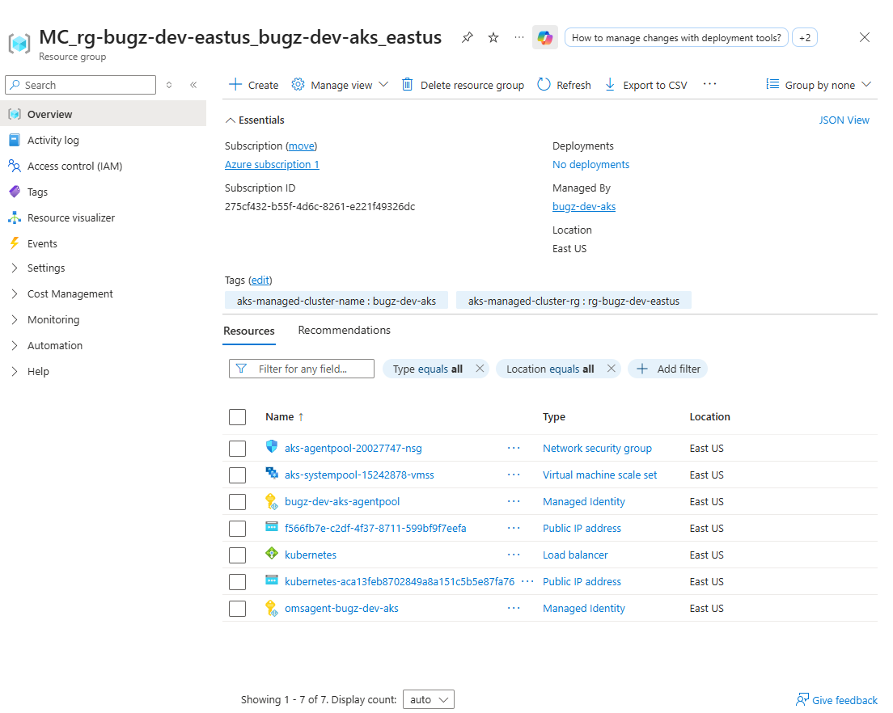

## 9. Load Balancer Frontend IPs

The frontend IP configuration page shows the public addresses assigned to the cluster load balancer.

One of the entries maps to the public application IP, `135.234.201.251`, which is the endpoint used to reach the live Bugz app.

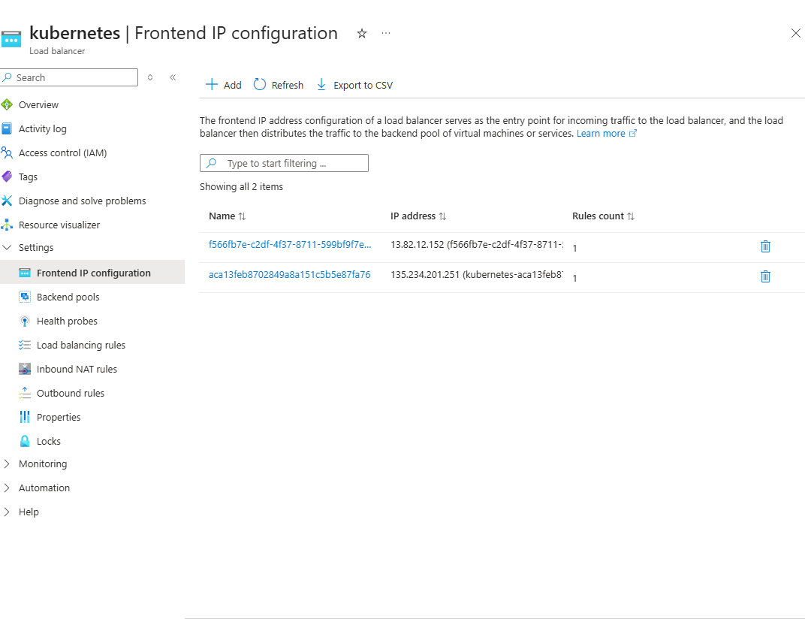

## 10. Load Balancer Backend Pools

The backend pools view shows where the load balancer actually sends traffic.

This ties the public load balancer to the AKS node infrastructure by linking backend pools to the `aks-systempool` node resources.

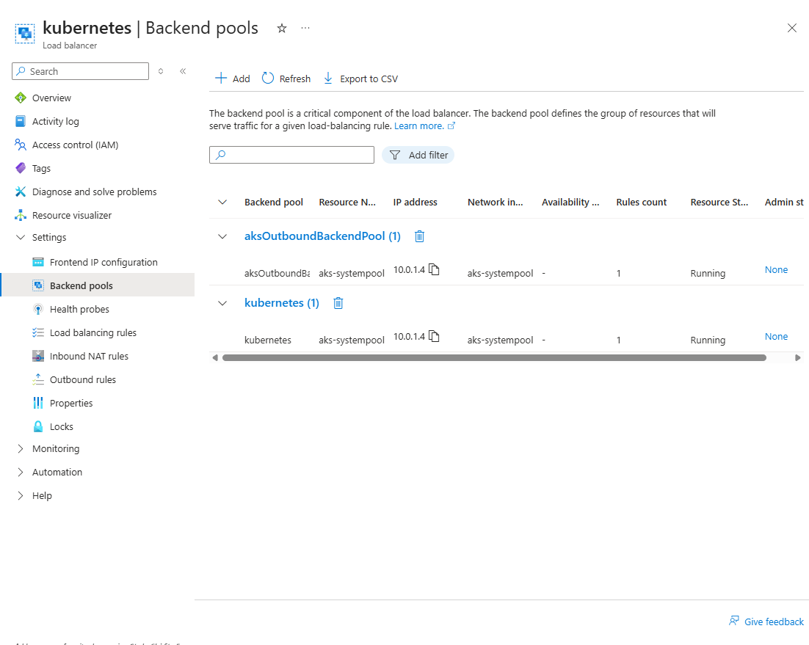

## 11. Load Balancing Rules

The load balancing rules page shows the concrete listener rule that distributes traffic.

In this deployment, Azure created a rule for TCP port `80`, which is the path used to route HTTP traffic from the public frontend to the backend pool hosting the workload.

## 12. Network Security Group Rules

This network security group is attached to the AKS-managed node infrastructure.

The screenshot clearly shows:

- an AKS-created inbound allow rule for port `80`
- the standard Azure virtual network and load balancer rules
- the default deny behavior after the explicit allow rules

This is a good screenshot for discussing how inbound traffic is constrained even in a simple public deployment.

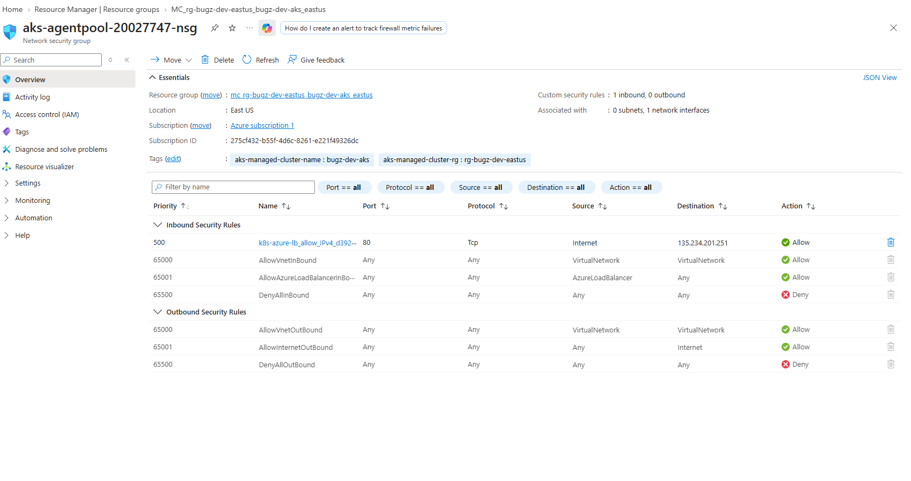

## 13. AKS Cluster Networking Summary

The AKS networking blade provides the higher-level view of how the cluster is configured.

This complements the subnet, NSG, and load balancer screenshots by showing the cluster-wide networking choices in one place:

- `Azure CNI Overlay`
- `Load Balancer` outbound type
- pod CIDR and service CIDR assignments
- standard load balancer usage
- public API server access status

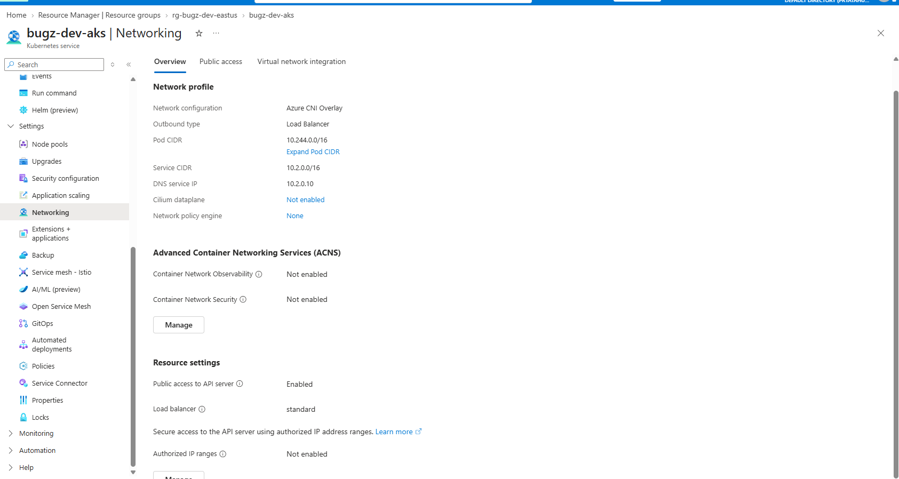

## 14. VM Scale Set Scaling

The scaling page shows the infrastructure-side capacity model for the node pool.

This screenshot is especially helpful for explaining the distinction between:

- scaling Kubernetes pods at the application layer
- scaling cluster nodes at the VM scale set layer

The node pool is configured for manual scale in this capture, with the instance count set to `1`.

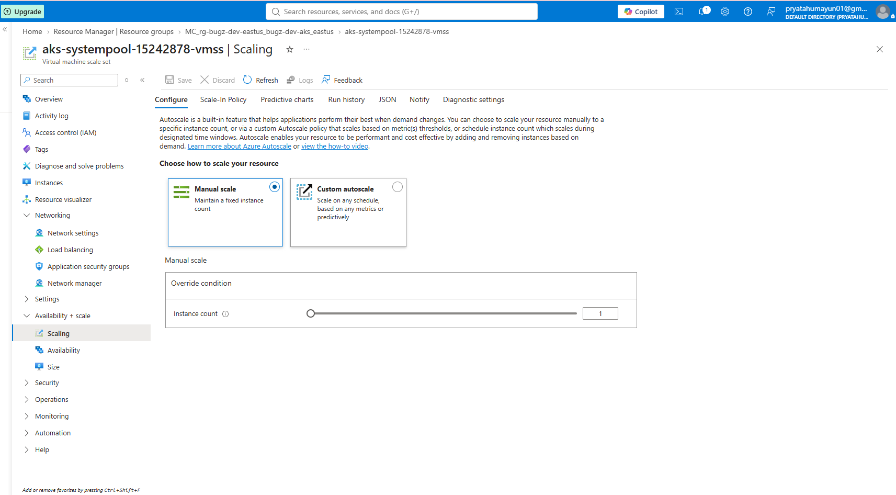

## 15. VM Size Selection

The size view shows the compute family and pricing options available to the node pool.

The current selected node size is visible as `Standard_D2s_v7`, which is a practical size for a small AKS proof of concept while still being large enough to demonstrate real cluster infrastructure.

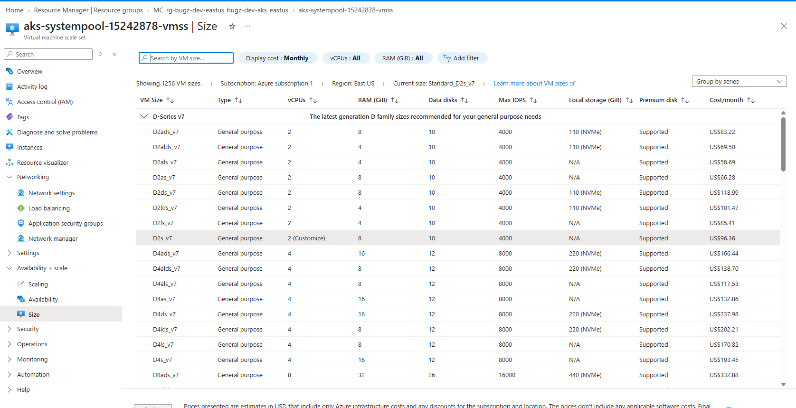

## 16. Availability Configuration

The availability page documents the resiliency posture of the node pool.

This is a useful place to discuss availability zones, zone balancing, and how Azure can spread worker infrastructure for higher resilience when needed.

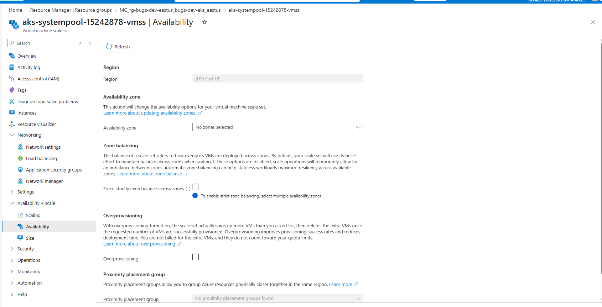

## 17. Live Application

The final screenshot closes the loop by showing the public application actually running through the Azure-managed load balancer.

This validates the full deployment path:

- Docker image built locally
- image pushed to ACR
- Kubernetes deployment applied to AKS
- public traffic routed through Azure networking
- application reachable from the browser

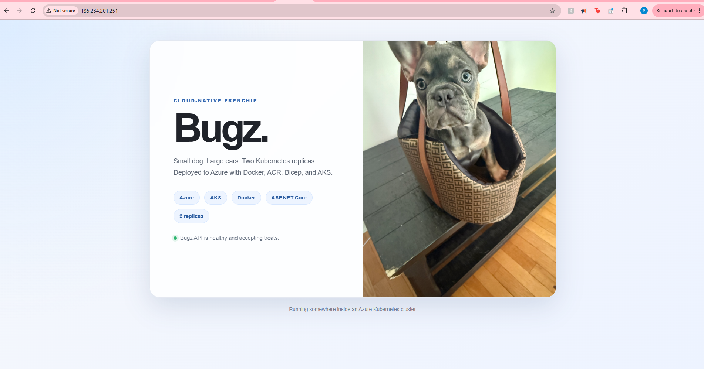
