# PK API on AWS ECS Fargate

A containerized API deployed to AWS using Amazon ECS, AWS Fargate, an Application Load Balancer, private networking, autoscaling, and Terraform.

## Project Overview

This project demonstrates the deployment of a containerized API into a production-style AWS environment.

The infrastructure includes:

- Amazon ECS
- AWS Fargate
- Amazon ECR
- Application Load Balancer
- Target Groups
- Amazon VPC
- Public and private subnets
- NAT Gateways
- Security Groups
- CloudWatch
- ECS Service Auto Scaling
- Terraform

## Architecture

```text
Internet
   |
   v
Application Load Balancer
   |
   v
ECS Target Group
   |
   v
ECS Service
   |
   +----------------+
   |                |
   v                v
Fargate Task 1   Fargate Task 2
   |                |
   +----------------+
           |
           v
     Private Subnets
           |
           v
       NAT Gateway
           |
           v
        Internet
```

## Networking

The environment uses a dedicated VPC with the CIDR range `10.40.0.0/16`.

The VPC contains:

- Two public subnets
- Two private subnets
- Two Availability Zones
- An Internet Gateway
- NAT Gateways
- Separate public and private route tables
- DNS resolution and DNS hostnames

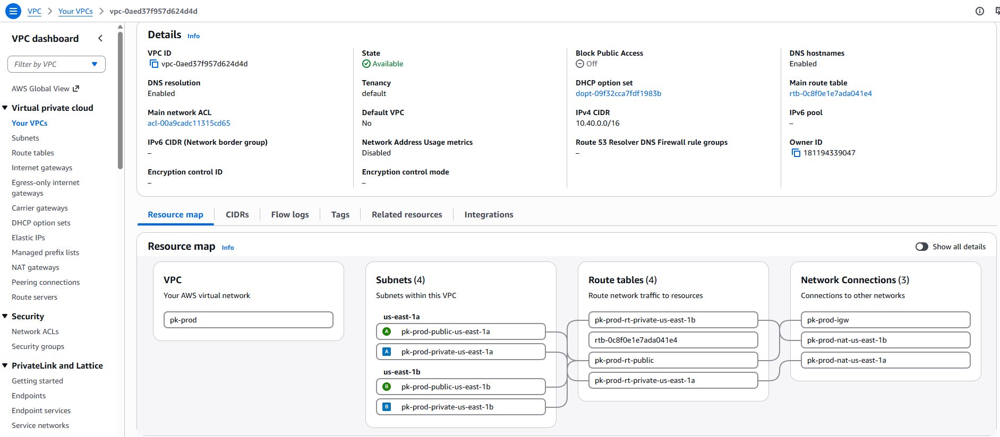

### Public Subnets

The public subnets contain the internet-facing Application Load Balancer and provide routes through the Internet Gateway.

### Private Subnets

The ECS Fargate tasks run inside private subnets.

The tasks do not receive direct inbound traffic from the internet. Outbound connectivity is provided through NAT Gateways.

## Security Groups

Separate security groups are used for the Application Load Balancer and ECS tasks.

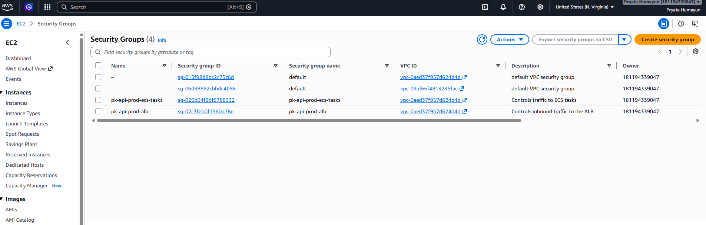

### Application Load Balancer Security Group

The ALB security group allows inbound HTTP traffic on port `80`.

| Direction | Protocol | Port | Source |
|---|---|---:|---|
| Inbound | TCP | 80 | `0.0.0.0/0` |

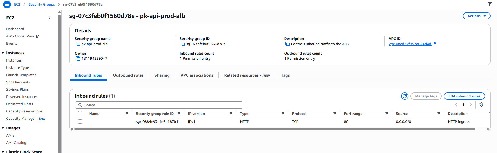

### ECS Task Security Group

The ECS task security group accepts traffic on port `8080` only from the Application Load Balancer security group.

| Direction | Protocol | Port | Source |
|---|---|---:|---|
| Inbound | TCP | 8080 | ALB Security Group |

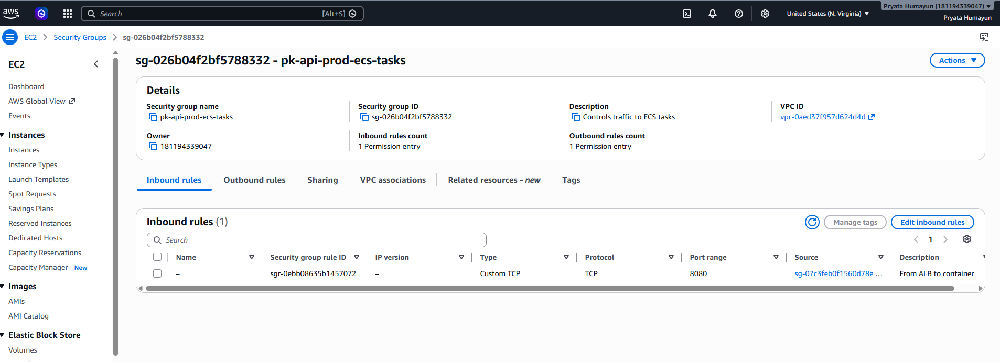

This prevents the containers from being accessed directly from the internet.

## NAT Gateways and Elastic IP Addresses

NAT Gateways provide outbound internet connectivity for ECS tasks running in private subnets.

Elastic IP addresses are attached to the NAT Gateways to provide stable outbound addresses.

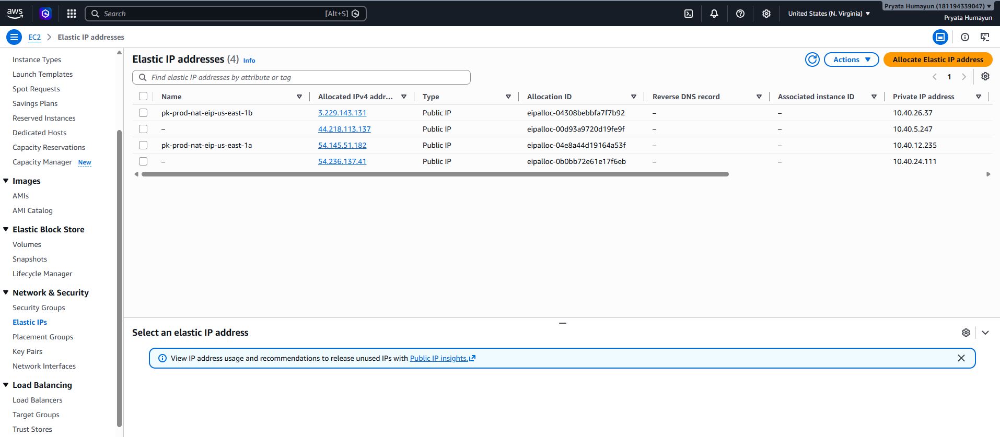 

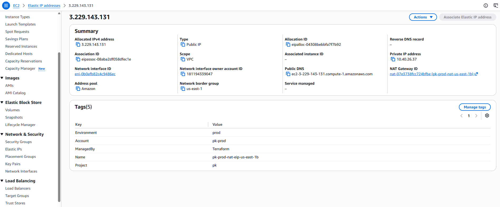

## Application Load Balancer

An internet-facing Application Load Balancer receives inbound web traffic.

The load balancer spans two Availability Zones and forwards requests to the ECS target group.

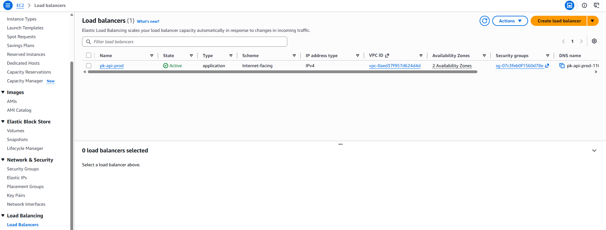

### Listener Configuration

The listener accepts HTTP traffic on port `80` and forwards it to the target group.

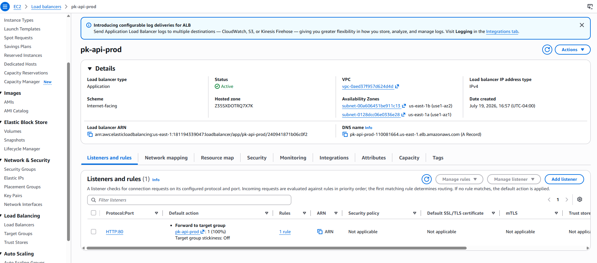

## Amazon ECS Cluster

The API runs in an Amazon ECS cluster using AWS Fargate.

Fargate provides serverless container compute, removing the need to manage EC2 container instances.

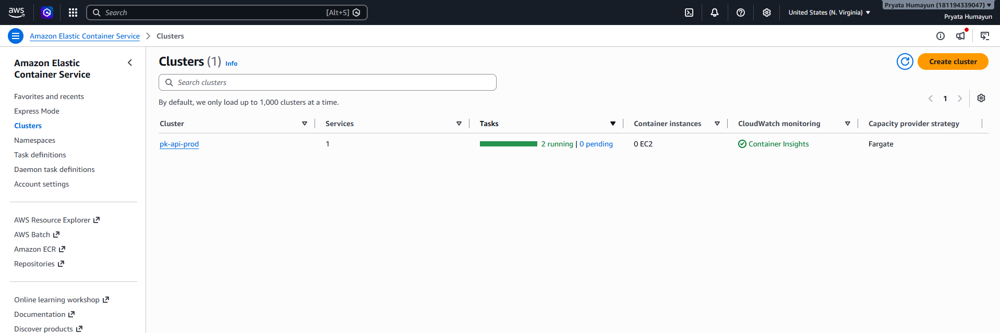

The cluster includes:

- One ECS service
- Two running tasks
- Fargate capacity provider
- CloudWatch Container Insights

## ECS Service

The ECS service maintains the required number of running tasks.

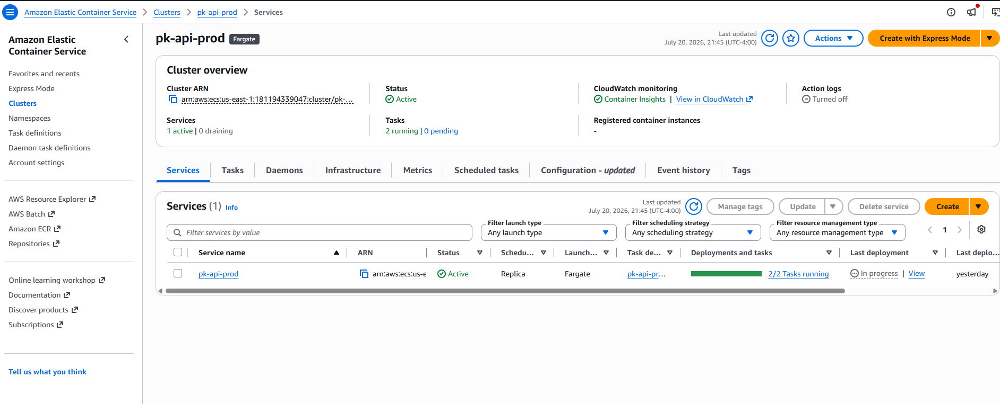

The service uses:

- Fargate launch type
- Replica scheduling
- Two desired tasks
- Application Load Balancer integration
- Rolling deployments
- Automatic task replacement

## Service Health

The ECS service is connected to the Application Load Balancer target group.

The running containers listen on port `8080`.

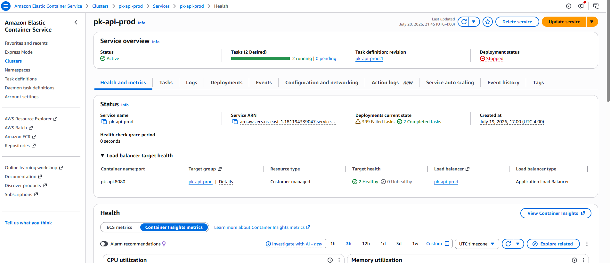
The load balancer sends traffic only to healthy tasks.

## Target Group

The target group uses IP targets because Fargate tasks receive their own private network interfaces and private IP addresses.

Configuration:

| Setting | Value |
|---|---|
| Target type | IP |
| Protocol | HTTP |
| Port | 8080 |
| Address type | IPv4 |

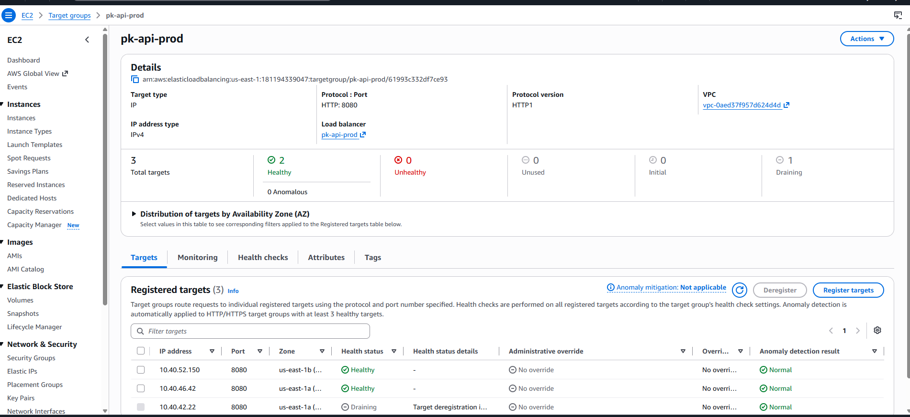

## Auto Scaling

ECS Service Auto Scaling adjusts the number of running tasks based on CPU utilization.

Configuration:

| Setting | Value |
|---|---:|
| Minimum tasks | 2 |
| Maximum tasks | 6 |
| Target CPU utilization | 70% |


When average CPU utilization rises above the target, ECS can launch additional Fargate tasks. When demand falls, ECS can reduce the number of tasks while respecting the configured minimum.

## Container Image

The application is packaged as a Docker image and stored in Amazon Elastic Container Registry.

```text
Application source
      |
      v
Docker build
      |
      v
Amazon ECR
      |
      v
ECS Task Definition
      |
      v
ECS Fargate Service
```

Add the ECR screenshot here:

```markdown

```

## Terraform

The AWS infrastructure is managed using Terraform.

Terraform provisions resources such as:

- VPC
- Subnets
- Route tables
- Internet Gateway
- NAT Gateways
- Elastic IP addresses
- Security Groups
- Application Load Balancer
- Target Group
- ECS Cluster
- ECS Service
- ECS Task Definition
- Auto Scaling
- IAM roles
- CloudWatch log groups

Example deployment commands:

```bash
terraform init
terraform fmt
terraform validate
terraform plan
terraform apply
```

To remove the environment:

```bash
terraform destroy
```

## Monitoring

CloudWatch Container Insights is enabled for the ECS cluster.

Monitoring includes:

- CPU utilization
- Memory utilization
- Running task count
- Task failures
- Application logs
- ECS service events
- Load balancer target health

Add screenshots here:

```markdown


```

## Running Application

The application is accessed through the DNS name of the Application Load Balancer.

Add the final application screenshot here:

```markdown

```

## Deployment Flow

```text
Developer
   |
   v
GitHub Repository
   |
   v
Docker Build
   |
   v
Amazon ECR
   |
   v
ECS Task Definition
   |
   v
ECS Service
   |
   v
AWS Fargate Tasks
   |
   v
Application Load Balancer
   |
   v
Application User
```

## Skills Demonstrated

- Infrastructure as Code with Terraform
- AWS networking design
- Public and private subnet architecture
- Containerization using Docker
- Container image management with ECR
- ECS and Fargate deployment
- Application Load Balancer integration
- Security group design
- Health checks
- High availability across Availability Zones
- Service autoscaling
- CloudWatch monitoring
- Cost-aware infrastructure management

## Future Improvements

- Configure HTTPS using AWS Certificate Manager
- Add a Route 53 custom domain
- Add AWS WAF protection
- Add GitHub Actions CI/CD
- Store application secrets in AWS Secrets Manager
- Add CloudWatch alarms and notifications
- Add automated container image scanning
- Add blue/green deployments
- Add automated API tests
- Add VPC endpoints to reduce NAT Gateway dependency

## Cleanup

Because NAT Gateways, Elastic IPs, the Application Load Balancer, and Fargate tasks can generate ongoing charges, the environment has been taken down to use my tokens for other exploration code 

```bash
terraform destroy
```

## Author

Pryata Humayun
