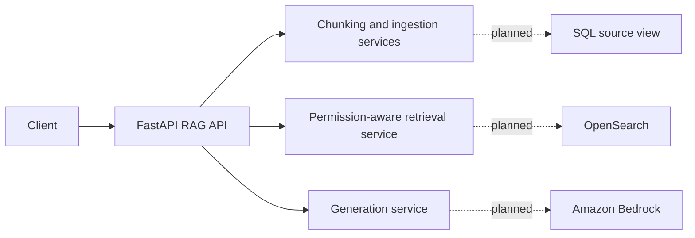

# RAG API Proof of Concept

This project is a FastAPI-based proof of concept for retrieval-augmented generation over curated source records. It is designed to show the end-to-end shape of a RAG API that:

- ingests source records from a SQL-backed system
- chunks and embeds content
- filters retrieval results by user and group permissions
- generates grounded answers with citations

The current codebase is intentionally mock-first. The API shape, models, service boundaries, and tests are real, while OpenSearch provisioning, SQL ingestion execution, and Bedrock-backed generation are still scaffolded for a later phase.

## What it does today

- exposes a FastAPI application with health, readiness, query, and ingestion routes
- answers `POST /api/v1/query` requests using an in-memory sample dataset
- applies record-level access checks based on `user_id`, `group_ids`, and visibility fields
- returns an answer plus lightweight source citations
- includes unit and integration tests for permission filtering and query relevance

## What is not finished yet

- `POST /api/v1/ingestion/run` returns `501 Implementation pending`
- `scripts/ingest_sql_view.py` is a placeholder
- `scripts/create_opensearch_index.py` is a placeholder
- OpenSearch and Bedrock settings exist, but local default providers are still mock implementations

## Architecture



## API endpoints

### `GET /health`

Returns a basic status check:

```json
{
  "status": "ok"
}
```

### `GET /ready`

Returns a simple readiness payload:

```json
{
  "database": true,
  "opensearch": true,
  "bedrock": true
}
```

Right now this is a static readiness response, not a live downstream dependency check.

### `POST /api/v1/query`

Queries the mock RAG flow.

Example request:

```json
{
  "question": "What is AWS Lambda?",
  "user_id": "bob",
  "group_ids": [],
  "top_k": 3,
  "category": "cloud",
  "source_system": "wiki"
}
```

Example response shape:

```json
{
  "answer": "Mock answer based on retrieved context...",
  "sources": [
    {
      "record_id": "aws-lambda",
      "title": "AWS Lambda overview",
      "source_url": "https://example.local/aws-lambda",
      "chunk_id": "aws-lambda:0",
      "score": 0.9
    }
  ],
  "retrieved_chunk_count": 1
}
```

### `POST /api/v1/ingestion/run`

Planned endpoint for SQL-to-index ingestion. Current behavior:

- always returns `501`

Example request shape:

```json
{
  "full_refresh": false,
  "limit": 100,
  "record_ids": ["123", "456"]
}
```

## Current query behavior

The query route currently seeds a small built-in dataset on first use:

- AWS Lambda overview
- Azure Functions overview
- Kubernetes overview

The route then:

1. chunks the sample records
2. embeds them with the mock embedding service
3. filters results by user/group access
4. retrieves the most relevant chunks
5. generates a grounded answer through the mock generation service

This makes the project runnable locally without Bedrock, OpenSearch, or a populated SQL source.

## Project structure

```text
app/
  api/routes/        FastAPI route handlers
  core/              configuration, exceptions, logging
  models/            request/response and domain models
  services/          chunking, embedding, retrieval, permissions, generation, RAG orchestration
scripts/             placeholder operational scripts
tests/               unit and integration tests
```

Key files:

- [app/main.py](/C:/Users/pryat/Downloads/playground-main/playground-main/projects/rag-api-poc/app/main.py)
- [app/core/config.py](/C:/Users/pryat/Downloads/playground-main/playground-main/projects/rag-api-poc/app/core/config.py)
- [app/api/routes/query.py](/C:/Users/pryat/Downloads/playground-main/playground-main/projects/rag-api-poc/app/api/routes/query.py)
- [app/api/routes/ingestion.py](/C:/Users/pryat/Downloads/playground-main/playground-main/projects/rag-api-poc/app/api/routes/ingestion.py)
- [app/services/rag_service.py](/C:/Users/pryat/Downloads/playground-main/playground-main/projects/rag-api-poc/app/services/rag_service.py)

## Local development

### Python setup

```bash
python -m venv .venv
source .venv/bin/activate
```

On Windows PowerShell:

```powershell
python -m venv .venv
.venv\Scripts\Activate.ps1
```

Install dependencies:

```bash
pip install -e ".[dev]"
```

Run the API:

```bash
uvicorn app.main:app --reload
```

Swagger UI will be available at:

```text
http://localhost:8000/docs
```

## Environment variables

The app reads settings from `.env`. A starter file is provided in [.env.example](/C:/Users/pryat/Downloads/playground-main/playground-main/projects/rag-api-poc/.env.example).

Important values:

- `AWS_REGION`
- `AWS_BEDROCK_EMBEDDING_MODEL_ID`
- `AWS_BEDROCK_GENERATION_MODEL_ID`
- `OPENSEARCH_ENDPOINT`
- `OPENSEARCH_INDEX_NAME`
- `DATABASE_URL`
- `SOURCE_VIEW_NAME`
- `DEFAULT_TOP_K`
- `MAX_TOP_K`
- `CHUNK_SIZE`
- `CHUNK_OVERLAP`
- `LOG_LEVEL`
- `EMBEDDING_PROVIDER`
- `GENERATION_PROVIDER`

Current defaults are chosen so the app can run locally with mock providers.

## Docker

Run the API and PostgreSQL locally with Docker Compose:

```bash
docker compose up --build
```

The compose file starts:

- `api` on port `8000`
- `postgres` on port `5432`

The default compose environment keeps:

- `EMBEDDING_PROVIDER=mock`
- `GENERATION_PROVIDER=mock`

## Testing

Run all tests:

```bash
pytest
```

The test suite currently covers:

- permission filtering behavior
- retrieval relevance
- basic RAG integration flow

Representative files:

- [tests/integration/test_rag_flow.py](/C:/Users/pryat/Downloads/playground-main/playground-main/projects/rag-api-poc/tests/integration/test_rag_flow.py)
- [tests/unit/test_permission_service.py](/C:/Users/pryat/Downloads/playground-main/playground-main/projects/rag-api-poc/tests/unit/test_permission_service.py)
- [tests/unit/test_text_transformation.py](/C:/Users/pryat/Downloads/playground-main/playground-main/projects/rag-api-poc/tests/unit/test_text_transformation.py)

## Example request

Once the API is running, you can test the query route with:

```bash
curl -X POST http://localhost:8000/api/v1/query \
  -H "Content-Type: application/json" \
  -d '{
    "question": "What is AWS Lambda?",
    "user_id": "bob",
    "group_ids": [],
    "top_k": 1
  }'
```

## Security model

This proof of concept does not implement authentication yet.

Instead:

- `user_id` is treated as a future authenticated claim
- `group_ids` are treated as future group claims
- retrieval filters results based on `allowed_users`, `allowed_groups`, and `is_public`

That makes the permission behavior testable without introducing auth infrastructure too early.

## Planned next steps

- implement SQL source ingestion behind `POST /api/v1/ingestion/run`
- provision and use a real OpenSearch index
- integrate Bedrock-backed embedding and generation providers
- add real readiness checks for downstream dependencies
- replace the hardcoded sample corpus with indexed source data

## Notes

- AWS credentials are expected through the normal AWS provider chain when real Bedrock or other AWS integrations are enabled
- the application currently targets Python `3.12+`
- the project is best understood as a working API shell with a realistic service decomposition, not as a finished production deployment
