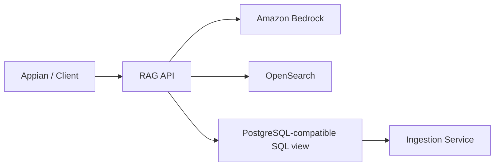

# RAG API Proof of Concept

This repository contains a production-ready proof-of-concept API for retrieving grounded answers from curated SQL-backed source data using FastAPI, Bedrock, OpenSearch, and PostgreSQL-compatible SQL.

## Architecture



## Current limitations

This proof of concept intentionally does not implement authentication. The `user_id` and `group_ids` values are treated as claims that would later come from an authenticated JWT.

## Local development

```bash
python -m venv .venv
source .venv/bin/activate  # on Windows use .venv\\Scripts\\activate
pip install -e ".[dev]"
uvicorn app.main:app --reload
```

## Testing

```bash
pytest
```

## Docker

```bash
docker compose up --build
```

## Notes

- AWS credentials are expected via the normal provider chain.
- The default embedding and generation providers are mock implementations so local development is possible without Bedrock access.
- OpenSearch and Bedrock integrations are scaffolded and intended to be completed in a later phase.
